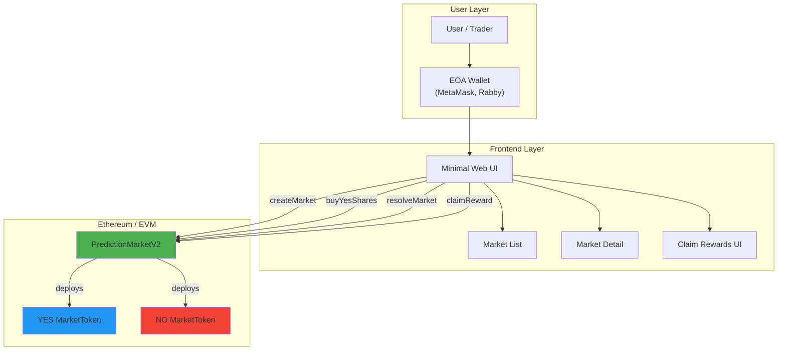
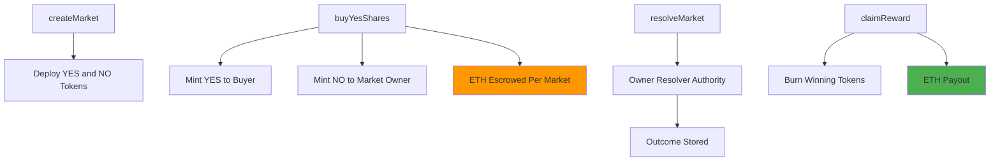
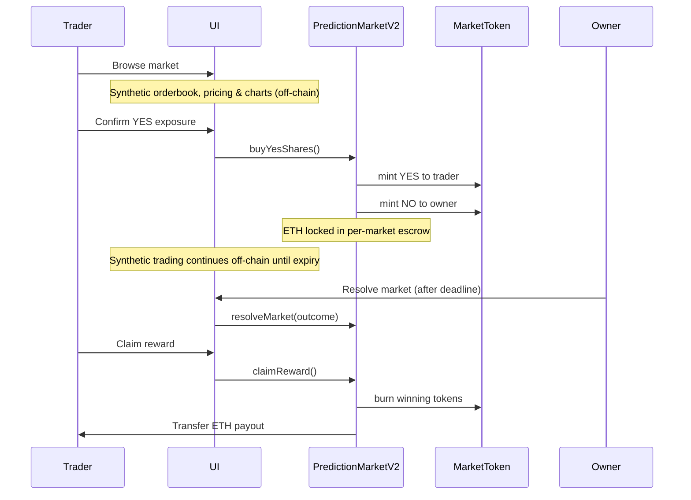

# Siprifi Prediction Market MVP – Architecture Review & Roadmap

**Document Version:** 3.0
**Date:** 2026-01-16
**Status:** MVP Technical Architecture (Pre-Lending Phase)



### Architectural Intent

This MVP implements the **risk tokenization layer** of Siprifi Finance.

* Each prediction market is isolated
* Risk is expressed as ERC20 YES / NO tokens
* ETH is escrowed per market
* No AMM, oracle, or lending logic is included

> This is a **foundational primitive**, not the full Siprifi protocol.

---

## 2. Core Contracts Overview

| Contract                 | Responsibility                                                  | Status      |
| ------------------------ | --------------------------------------------------------------- | ----------- |
| `PredictionMarketV2.sol` | Market lifecycle, per-market ETH escrow, resolution, payout     | Implemented |
| `MarketToken.sol`        | ERC20 YES / NO outcome tokens (risk representation)             | Implemented |

---

## 3. PredictionMarketV2 – Contract Architecture



---

## 4. Market Lifecycle (MVP)



---

## 5. Economic Model (Current MVP)

### 5.1 Share Minting Logic

| Action             | Result                       |
| ------------------ | ---------------------------- |
| Buy YES with X ETH | YES: X minted to buyer       |
|                    | NO: X minted to market owner |
|                    | ETH locked in escrow         |

**Assumptions:**

* Fixed 1:1 pricing
* No dynamic probability
* No liquidity curve

---

### 5.2 Payout Formula

```text
payout = (marketEscrowETH × userWinningBalance) / totalWinningSupply
```

Properties:

* Zero-sum per market
* Proportional distribution
* Deterministic

---

## 6. Trust & Security Model (Explicit MVP Assumptions)

### 6.1 Trust Assumptions

| Component         | Trust Model         |
| ----------------- | ------------------- |
| Market Resolution | Fully trusted owner |
| Pricing(On-chain) | Fixed mint ratio (YES/NO = 1:1)    |
| Pricing(Off-Chain)| Synthetic, frontend-derived
| Oracle            | None                |
| Governance        | None                |

> These assumptions are **intentional for MVP speed**.

---

### 6.2 Known Security Gaps

| Risk                   | Description                     |
| ---------------------- | ------------------------------- |
| Centralized resolution | Market owner resolves outcome without oracle or dispute mechanism   |
| No reentrancy guard    | claimReward() lacks explicit ReentrancyGuard (mitigated by state updates) |
| Shared ETH balance     | RESOLVED✅ Each market now has isolated escrow accounting|
| No pause mechanism     | Contracts cannot be halted in emergencies     |
| No dispute window      | Resolution is final once executed      |

---

## 7. Code Status Summary

### Implemented ✅

* Market creation (factory-style, isolated markets)

* Dual ERC20 outcome tokens (YES / NO)

* Per-market ETH escrow (isolated, non-shared)

* Outcome resolution (owner-driven)

* Proportional payout with token burn

* YES soulbound behavior (pre-resolution)

* NO token collateral lifecycle (pre-resolution validity)

* Transfer gating based on market state

### Not Implemented ❌ (By Design)

* AMM-based pricing

* On-chain price discovery

* Oracle-based resolution

* Secondary on-chain trading

* Automated market maker curves

* Lending / borrowing engine

* Liquidation logic

* Dispute or challenge window

Protocol fees

---

## 8. Planned Short-Term Improvements (V1)

| Priority  | Feature               | Status V3.0                  |
| --------- | --------------------- | ---------------------------- |
| 🔴 High   | Per-market escrow     | ✅ RESOLVED |
| 🔴 High   | ReentrancyGuard       | ❌ Pending       |
| 🟡 Medium | Permissioned resolver | ❌ Pending               |
| 🟡 Medium | Dispute window        | ❌ Pending         |
| 🟢 Low    | Market fees           | ❌ Pending           |

---

## 9. Siprifi Finance Integration Roadmap

### Phase 0 – Current (This Repo)

* Risk tokenization
* Binary outcome tokens
* ETH-settled markets

### Phase 1 – Collateral Acceptance

* YES / NO tokens whitelisted
* Oracle-based pricing
* LTV parameters
* Deposit-only lending

### Phase 2 – Risk Engine

* Concentration limits
* Correlated market groups
* Borrowing power offsets

### Phase 3 – Full Protocol

* Permissionless markets
* DAO governance
* Safety module
* Cross-market liquidity

---

## 10. How This MVP Fits the Whitepaper

| Whitepaper Concept        | MVP Status                  |
| ------------------------- | --------------------------- |
| Outcome risk tokenization | ✅ Implemented              |
| ERC20 outcome assets      | ✅ Implemented              |
| Trustless settlement      | ✅ Implemented              |
| Capital efficiency        | ❌ Not yet                  |
| Lending                   | ❌ Future                   |
| On-chain price discovery  | ❌ Explicitly excluded      |

> This MVP validates **the atomic unit of Siprifi risk**.

---

## 11. Deployment Notes

* Target: Testnet only
* Solidity: ^0.8.24
* No audits
* No upgradeability

---

## 12. Disclaimer

This code is experimental and unaudited.

* No financial guarantees
* No oracle protections
* Use for research and prototyping only

---

**© 2026 Siprifi Finance – Internal MVP Architecture Document**
